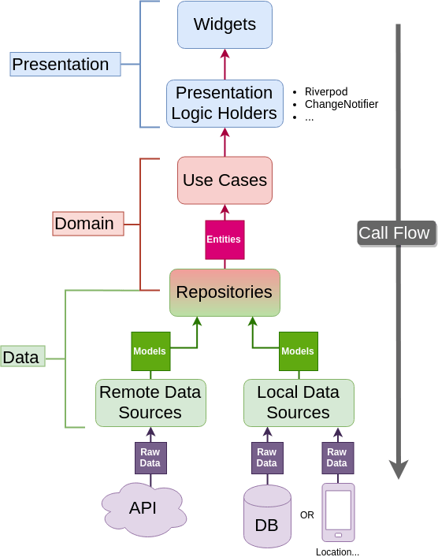

# Flutter Riverpod Clean Architecture

The app is an example on Flutter Clean Architecture using riverpod state management.

Some resources, packages and plugins used in the project:

- [Flutter Riverpod](https://pub.dev/packages/flutter_riverpod)
- [Equatable](https://pub.dev/packages/equatable)
- [Freezed Annotation](https://pub.dev/packages/freezed_annotation)
- [Dartz](https://pub.dev/packages/dartz)
- [Get it](https://pub.dev/packages/get_it)
- [Dio](https://pub.dev/packages/dio)
- [Shimmer](https://pub.dev/packages/shimmer)

- [Build runner](https://pub.dev/packages/build_runner)
- [Freezed](https://pub.dev/packages/freezed)

App's screenshot:

